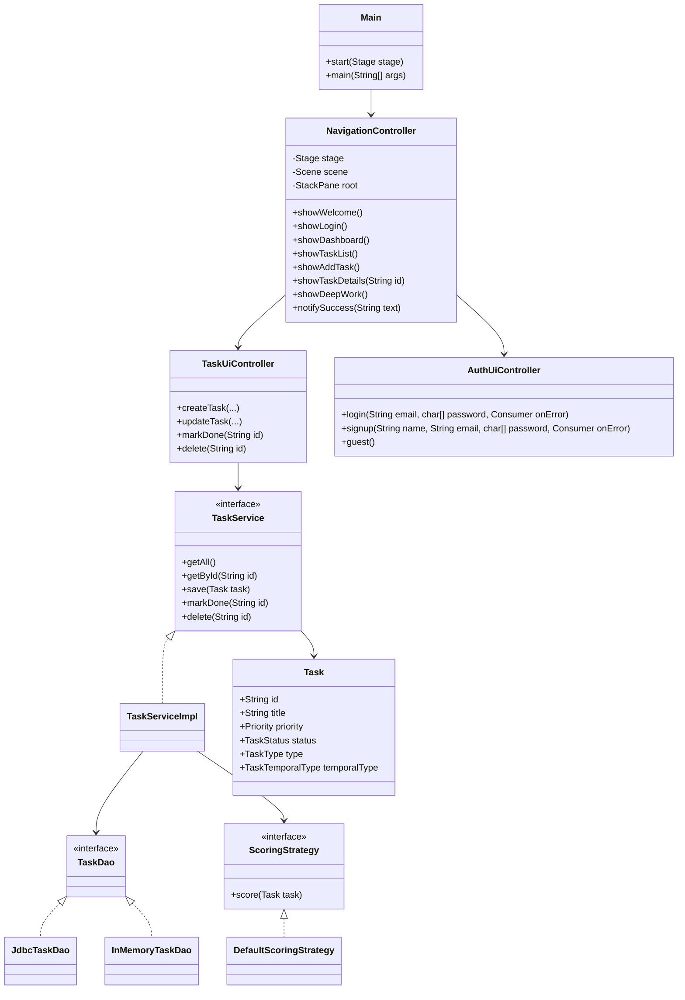

# Class Diagram

## Notes

This is a simplified class diagram focused on the main task and navigation path. The repository contains additional services for analytics, goals, temporal intelligence, AI coach, and smart schedule.

