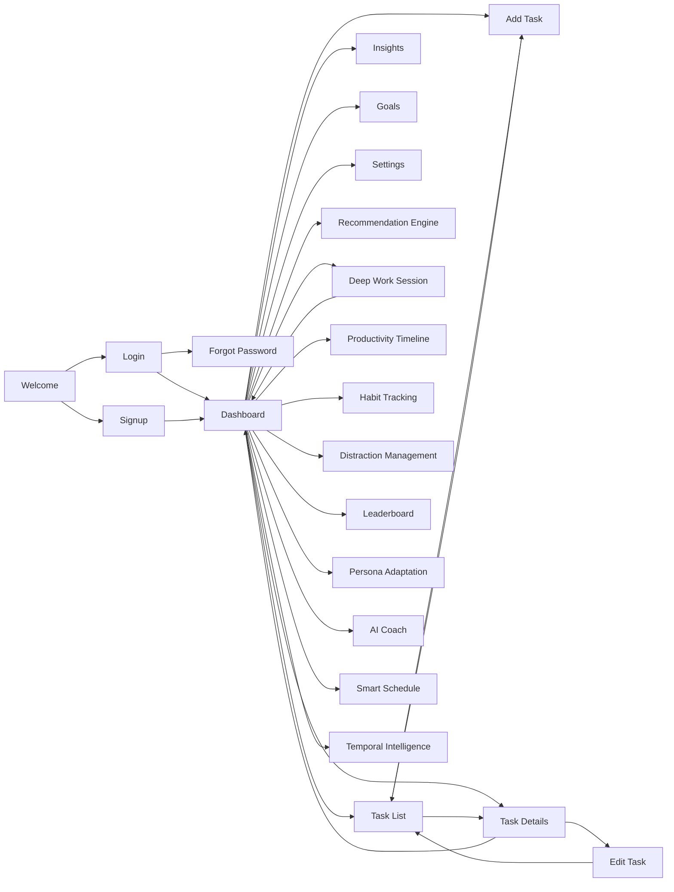

# Navigation Flow

```mermaid
flowchart LR
    Welcome["Welcome"]
    Login["Login"]
    Signup["Signup"]
    Forgot["Forgot Password"]
    Dashboard["Dashboard"]
    Tasks["Task List"]
    Add["Add Task"]
    Details["Task Details"]
    Edit["Edit Task"]
    Insights["Insights"]
    Goals["Goals"]
    Settings["Settings"]
    Recommendations["Recommendation Engine"]
    DeepWork["Deep Work Session"]
    Timeline["Productivity Timeline"]
    Habits["Habit Tracking"]
    Distractions["Distraction Management"]
    Leaderboard["Leaderboard"]
    Persona["Persona Adaptation"]
    Coach["AI Coach"]
    Schedule["Smart Schedule"]
    Temporal["Temporal Intelligence"]

    Welcome --> Login
    Welcome --> Signup
    Login --> Dashboard
    Signup --> Dashboard
    Login --> Forgot

    Dashboard --> Tasks
    Dashboard --> Add
    Dashboard --> Details
    Dashboard --> Insights
    Dashboard --> DeepWork

    Tasks --> Add
    Tasks --> Details
    Details --> Edit
    Details --> Dashboard
    Edit --> Tasks
    Add --> Tasks

    Dashboard --> Recommendations
    Dashboard --> Goals
    Dashboard --> Settings
    Dashboard --> Timeline
    Dashboard --> Habits
    Dashboard --> Distractions
    Dashboard --> Leaderboard
    Dashboard --> Persona
    Dashboard --> Coach
    Dashboard --> Schedule
    Dashboard --> Temporal

    DeepWork --> Dashboard
```

## Notes

The real implementation centralizes these transitions in `NavigationController`.

