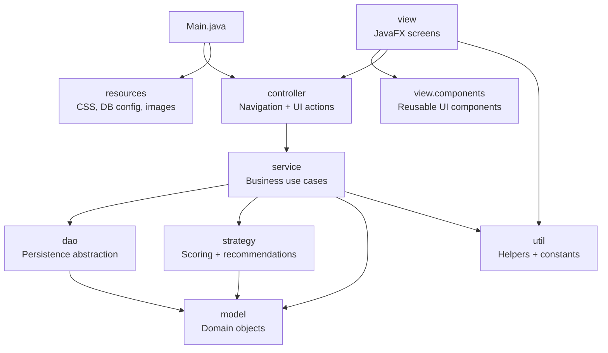

# Package Diagram

## Notes

- The direction points from higher-level orchestration to lower-level dependencies.
- The UI layer is JavaFX-specific.
- Service, DAO, strategy, and model layers are mostly JavaFX-independent.

