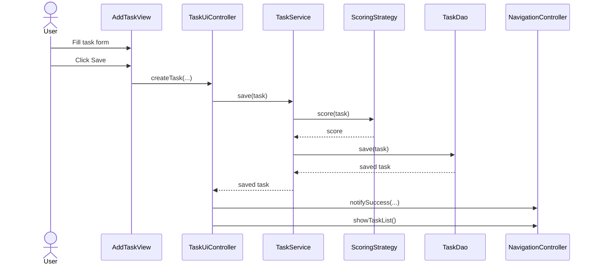

# Task Flow Sequence

```mermaid
sequenceDiagram
    actor User
    participant View as AddTaskView
    participant Controller as TaskUiController
    participant Service as TaskService
    participant Strategy as ScoringStrategy
    participant DAO as TaskDao
    participant Nav as NavigationController

    User->>View: Fill task form
    User->>View: Click Save
    View->>Controller: createTask(...)
    Controller->>Service: save(task)
    Service->>Strategy: score(task)
    Strategy-->>Service: score
    Service->>DAO: save(task)
    DAO-->>Service: saved task
    Service-->>Controller: saved task
    Controller->>Nav: notifySuccess(...)
    Controller->>Nav: showTaskList()
```

## Notes

This sequence demonstrates separation of concerns. The view does not calculate task score and does not access the DAO.

