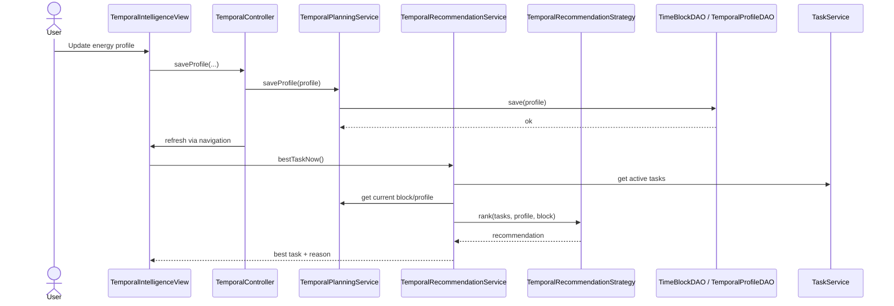

# Temporal Intelligence Sequence

```mermaid
sequenceDiagram
    actor User
    participant View as TemporalIntelligenceView
    participant Controller as TemporalController
    participant Planning as TemporalPlanningService
    participant Reco as TemporalRecommendationService
    participant Strategy as TemporalRecommendationStrategy
    participant DAO as TimeBlockDAO / TemporalProfileDAO
    participant TaskService as TaskService

    User->>View: Update energy profile
    View->>Controller: saveProfile(...)
    Controller->>Planning: saveProfile(profile)
    Planning->>DAO: save(profile)
    DAO-->>Planning: ok
    Controller->>View: refresh via navigation

    View->>Reco: bestTaskNow()
    Reco->>TaskService: get active tasks
    Reco->>Planning: get current block/profile
    Reco->>Strategy: rank(tasks, profile, block)
    Strategy-->>Reco: recommendation
    Reco-->>View: best task + reason
```

## Notes

Temporal Intelligence is a complete vertical slice. It is the best example to show future extensibility.

